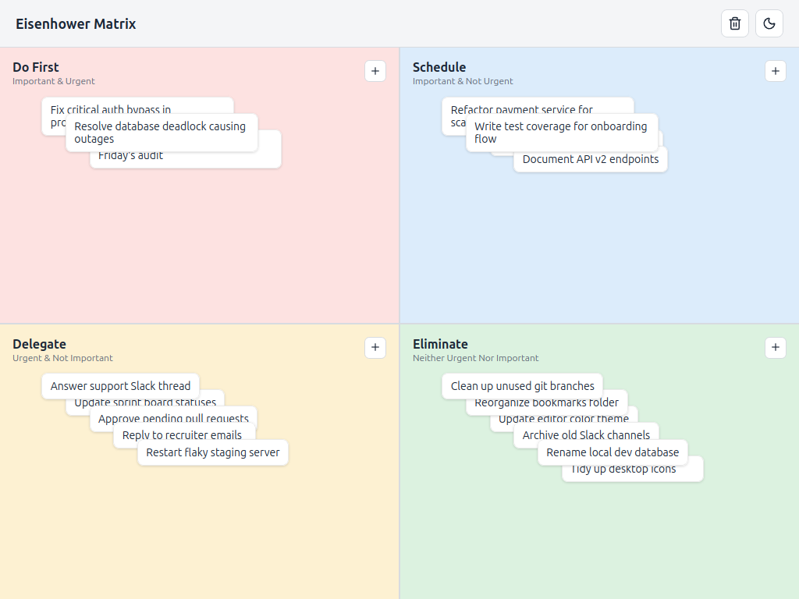
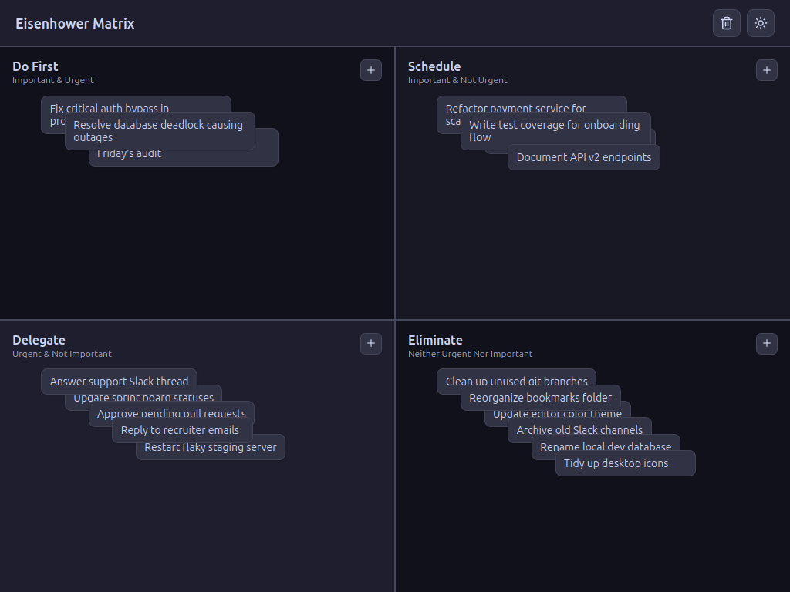

# Eisenhower Matrix

A desktop Eisenhower Matrix app built with Wails (Go backend) and Vue 3 + TypeScript (frontend).

- Q1 (top-left): Important & Urgent
- Q2 (top-right): Important & Not Urgent
- Q3 (bottom-left): Urgent & Not Important
- Q4 (bottom-right): Neither
- Double-click a quadrant to create a task there, like Obsidian Canvas
- Light/dark mode toggle (sun/moon icon, top right)
- Tasks persist to `~/.config/eisenhower-matrix/tasks.json`

## Screenshots

| Light | Dark |
| --- | --- |
|  |  |

## Prerequisites

- Go 1.25+ (the toolchain will auto-upgrade via `go.mod` if needed)
- Node (use the version in `frontend/.nvmrc`: `nvm use`)
- nvm, so `install.sh` can pick up the pinned Node version

## Install

On unix-like systems (Linux, macOS), run the install script from the project root:

```
./install.sh
```

This installs the Wails CLI, the frontend npm packages, the Go module
dependencies, and (on Linux) the WebKit dev headers required to build/run the
GUI. It finishes by running `wails doctor` so you can confirm everything is
set up correctly.

**PATH note:** the Wails CLI is installed to `$(go env GOPATH)/bin` (typically
`~/go/bin`). If running `wails` afterward gives you `command not found`, that
directory isn't on your `PATH`. Add it to your shell profile (e.g. `~/.bashrc`
or `~/.zshrc`):

```
export PATH="$PATH:$(go env GOPATH)/bin"
```

Then restart your terminal or run `source ~/.bashrc` (or the equivalent for
your shell).

## Live Development

From the project root:

```
wails dev
```

This runs the app with hot reload for frontend changes. A dev server also runs at
http://localhost:34115 if you want to open it in a browser and call the Go methods
from devtools.

## Testing

Frontend unit tests (vitest):

```
cd frontend
npm run test
```

Backend build check:

```
go build ./...
```

## Building

To build a redistributable, production-mode package:

```
wails build
```
